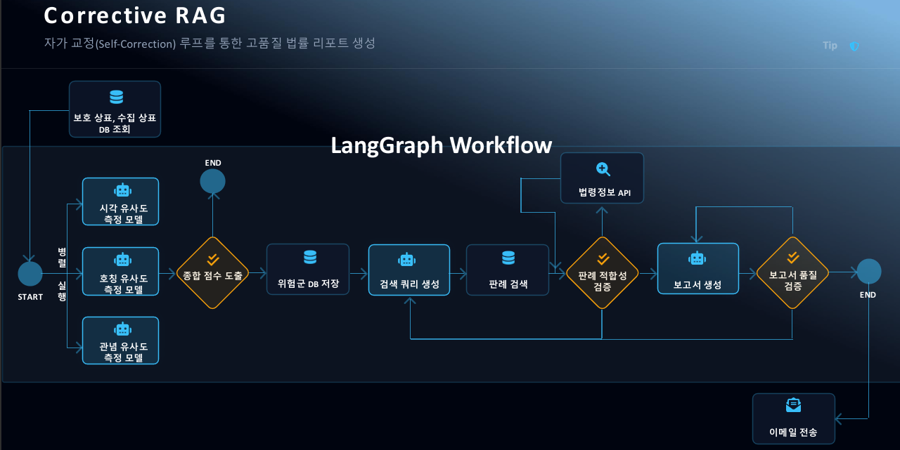
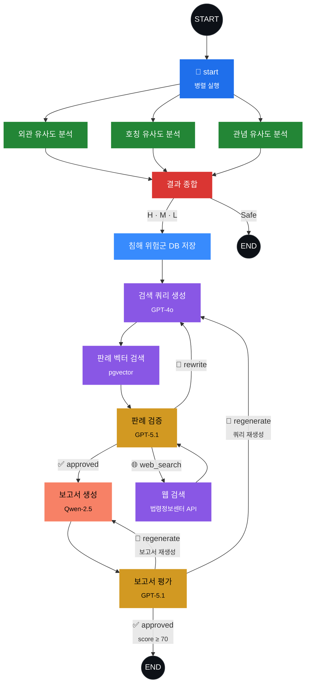

# TIP - Trademark Infringement Protector

> **Corrective RAG 기반 상표권 침해 자동 모니터링 시스템**

<p align="center">
  
</p>

## 프로젝트 개요

국내 상표 등록 건수는 매년 약 25만 건 이상이며, 온라인 마켓플레이스에서의 **상표권 침해 사례는 지속적으로 증가**하고 있습니다. 

기존의 상표권 침해 감시는 변리사가 수작업으로 유사 상표를 검색하고, 판례를 조사하며, 보고서를 작성하는 방식에 의존해 왔습니다.

이 과정에는 다음과 같은 문제가 존재합니다:

| 문제 | 설명 |
|---|---|
| **시간 비용** | 1건의 침해 분석 보고서 작성에 전문가 기준 평균 2~3시간 소요 |
| **확장성 한계** | 수천 개의 보호 상표 × 수만 개의 수집 상표 조합을 사람이 모두 검토하기 불가능 |
| **일관성 부재** | 담당자에 따라 유사도 판단 기준이 상이하여 분석 품질 편차 발생 |
| **실시간 대응 불가** | 신규 등록·출원 상표를 실시간으로 모니터링하기 어려움 |

**TIP**은 이러한 문제를 해결하기 위해, 상표의 **외관(Visual)·호칭(Phonetic)·관념(Conceptual)** 3가지 관점에서 AI 기반 유사도 분석을 수행하고, **Corrective RAG**로 관련 판례, 최종 침해 분석 보고서를 자동 검증한 뒤, 담당 변리사에게 이메일로 발송하는 **End-to-End 자동화 시스템**입니다.

---

## 목차

- [LangGraph 워크플로우](#langgraph-워크플로우)
- [핵심 기능 상세](#핵심-기능-상세)
- [기술 스택](#기술-스택)
- [LLM 역할 및 모델 구성](#llm-역할-및-모델-구성)
- [프로젝트 구조](#프로젝트-구조)
- [인프라 및 배포](#인프라-및-배포)
- [환경 설정](#환경-설정)
- [실행 방법](#실행-방법)

---

## LangGraph 워크플로우

보호 상표와 수집 상표 1:1 쌍마다 아래 워크플로우가 실행됩니다.

<p align="center">
  
</p>



### 워크플로우 단계별 설명

| 단계 | 노드 | 처리 내용 | 사용 모델 / 도구 |
|:---:|---|---|---|
| 1 | **start** | Fan-out 분기점. 3개 유사도 분석을 병렬 실행 | - |
| 2 | **visual_similarity** | 상표 이미지 벡터 간 코사인 유사도 산출 | NumPy |
| 3 | **phonetic_similarity** | 음역 변환 → 자모 분해 → JaroWinkler + Partial Ratio 조합 점수 산출 | GPT-5.1-chat, MeCab-ko, g2pk, jamo, rapidfuzz |
| 4 | **conceptual_similarity** | 이미지 캡셔닝 → 텍스트 임베딩 → 코사인 유사도 산출 | GPT-5.1-chat (Vision), text-embedding-3-large |
| 5 | **ensemble_model** | Piecewise Linear 보정 → 식별력 평가 → 동적 가중치 → 위험도 결정 | GPT-5.1-chat, pgvector |
| 6 | **save_risk** | 위험군 판정 데이터를 DB에 저장 | PostgreSQL |
| 7 | **generate_query** | 분석 결과 기반 판례 검색 자연어 쿼리 생성 | GPT-4o |
| 8 | **retrieve_precedents** | HML 패턴 매칭 기반 유사 판례 벡터 검색 | pgvector |
| 9 | **grade_precedents** | 검색된 판례 적합성 검증 (Structured Output) | GPT-5.1-chat |
| 10 | **web_search** | 법령정보센터 Open API로 외부 판례 보충 검색 | 법령정보센터 API |
| 11 | **generate_report** | 분석 결과 + 판례를 종합한 침해 분석 보고서 생성 | Qwen-2.5-7B (vLLM) |
| 12 | **evaluate_report** | 보고서 품질 평가 및 승인/재생성 결정 (Structured Output) | GPT-5.1-chat |

### Self-Correction 루프 (Corrective RAG)

워크플로우에는 출력 품질을 보장하기 위한 **3개의 자기 교정 루프**가 내장되어 있습니다:

| 루프 | 트리거 | 최대 횟수 | 동작 |
|---|---|:---:|---|
| **Query Rewrite** | 판례 검증 결과 `rewrite` | 3회 | 피드백 기반 검색 쿼리 재생성 |
| **Web Search Fallback** | 판례 검증 결과 `web_search` | 3회 | 법령정보센터 API로 외부 판례 보충 |
| **Report Regeneration** | 보고서 평가 점수 < 70점 | 3회 | 평가 피드백 반영하여 보고서 재생성 |

---

## 핵심 기능 상세

### 1. 3-Track 유사도 분석 (병렬 실행)

```
보호 상표 vs 수집 상표
    ├── 외관(Visual)   : 이미지 벡터 코사인 유사도
    ├── 호칭(Phonetic) : 한국어 음운 특성 반영 3-Tier Decision Logic
    └── 관념(Conceptual): GPT Vision 캡셔닝 → 임베딩 → 코사인 유사도
```

**외관 유사도**: DB에 사전 저장된 이미지 임베딩 벡터 간 코사인 유사도를 산출합니다.

**호칭 유사도**: GPT-5.1-chat으로 외래어/영문 상표명을 한국어 음역으로 변환 후, `MeCab-ko` + `g2pk`로 표준 발음을 생성합니다. 이후 자모 분해 → 한국어 음운 특성 반영 커스텀 자모 스코어링, JaroWinkler, Partial Ratio를 **단어 길이에 따라 동적 가중 조합**하는 3-Tier Decision Logic을 적용합니다.

**관념 유사도**: GPT-5.1-chat의 Vision 기능으로 양쪽 상표 이미지를 캡셔닝하고, `text-embedding-3-large`로 임베딩한 뒤 코사인 유사도를 산출합니다.

<!--
📸 이미지 삽입 권장 위치 #4: 3-Track 유사도 분석 예시
   - 실제 상표 이미지 쌍과 각 유사도 점수가 표시된 분석 결과 스크린샷
   - 예시: 
-->

### 2. 앙상블 모델 (동적 가중치 + 위험도 분류)

3개 유사도 점수를 단순 평균하지 않고, 상표 고유 특성에 맞는 **동적 가중치**를 산출합니다:

1. **Piecewise Linear Calibration** — 각 유사도 점수를 구간별 선형 보간으로 보정
2. **거절 사유 검색** — pgvector에서 유사한 기존 심사 거절 사례를 조회하여 참고 자료로 활용
3. **GPT 기반 식별력 평가** — 상표의 시각·발음·관념 각 요소별 식별력 등급(1~5)을 평가하여 가중치로 변환
4. **위험도 결정 규칙**:
   - **Dominant Part Rule (요부 관찰)**: 식별력이 강하고 유사도가 높은 요소가 있으면 해당 점수를 최종 점수로 채택
   - **Overall Observation Rule (전체 관찰)**: 그 외 경우 가중 RMS(Root Mean Square)로 종합 점수 산출
5. **최종 위험도 분류**: H(≥0.70) / M(≥0.55) / L(≥0.40) / Safe(<0.40)

### 3. Corrective RAG 판례 파이프라인

단순 Retrieval 이 아닌 **검증 → 자기 교정** 루프를 통해 판례의 품질을 보장합니다:

- **검색**: pgvector 벡터 DB에서 HML 패턴(위험도 패턴) 매칭을 적용한 유사 판례 검색
- **검증**: GPT-5.1-chat이 `JudgeDecision` Structured Output으로 적합성 판단
- **교정**: 부적합 시 쿼리 재생성(rewrite) 또는 법령정보센터 API 외부 검색(web_search)으로 보충

### 4. 보고서 생성 및 품질 평가

- **생성**: Qwen-2.5-7B (Azure ML에서 vLLM으로 서빙)가 분석 결과와 판례를 종합하여 Markdown 형식 보고서 작성
- **평가**: GPT-5.1-chat이 `EvaluationResult` Structured Output으로 보고서 품질 점수(0~100) 및 피드백 생성
- **재생성**: 70점 미만 시 피드백을 반영하여 자동 재생성 (최대 3회)

### 5. 이메일 자동 발송

승인된 보고서는 보호 상표 단위로 묶어 담당 변리사에게 **HTML 이메일**로 자동 발송합니다. 상표 이미지는 본문에 인라인 삽입됩니다.


---

## 기술 스택

| 분류 | 기술 | 용도 |
|---|---|---|
| **Orchestration** | LangGraph (StateGraph) | 워크플로우 상태 관리, 조건부 라우팅, 병렬 실행 |
| **LLM** | Azure OpenAI (GPT-5.1-chat, GPT-4o) | 판례 검증, 보고서 평가, 이미지 캡셔닝, 식별력 평가 |
| **LLM Serving** | vLLM on Azure ML | Qwen-2.5-7B 모델 서빙 (보고서 생성) |
| **Embedding** | jina-embedding-v2, text-embedding-3-large | 관념 유사도 임베딩, 판례 벡터 검색 |
| **Database** | PostgreSQL + pgvector | 벡터 유사도 검색, 상표·판례·거절사유 데이터 저장 |
| **Korean NLP** | MeCab-ko, g2pk, jamo, rapidfuzz | 형태소 분석, 발음 변환, 자모 분해, 문자열 유사도 |
| **Framework** | LangChain, Pydantic v2, Jinja2 | LLM 인터페이스, 데이터 검증, 프롬프트 템플릿 |
| **Infra** | Azure ML (Compute Cluster, Pipeline, Schedule) | 일일 배치 실행, 자동 스케일링, Cron 스케줄 |
| **Async** | asyncio, asyncpg, aiohttp | 비동기 DB 연결, 비동기 API 호출 |
| **Container** | Docker | 커스텀 런타임 환경 (MeCab-ko, Java 등 시스템 의존성 포함) |

---

## LLM 역할 및 모델 구성

| 역할 | 모델 | 담당 노드 | 호출 방식 |
|---|---|---|---|
| **Judge / Evaluator** | GPT-5.1-chat | 판례 검증, 보고서 평가, 식별력 평가 | Azure OpenAI · Structured Output |
| **Vision / Caption** | GPT-5.1-chat | 이미지 캡셔닝, 시각적 묘사, 음역 변환 | Azure OpenAI · Vision API |
| **Query Generator** | GPT-4o | 판례 검색 쿼리 생성 | Azure OpenAI |
| **Reporter** | Qwen-2.5-7B | 보고서 생성 | vLLM (Azure ML Managed Endpoint) |
| **Embedding** | text-embedding-3-large | 관념 임베딩, 판례 검색 쿼리 임베딩 | Azure OpenAI Embeddings |

> **Qwen-2.5-7B**는 Azure ML의 Managed Online Endpoint에서 **vLLM**으로 서빙됩니다.
> OpenAI-compatible API를 제공하므로 `AsyncOpenAI` 클라이언트로 동일하게 호출할 수 있습니다.

---

## 프로젝트 구조

```
tip-project/
├── src/
│   ├── main.py                       # 배치 작업 진입점 (Azure Container Job)
│   ├── container.py                  # 싱글톤 DI 컨테이너 (LLM 클라이언트, VectorStore 등)
│   │
│   ├── configs/
│   │   ├── __init__.py               # YAML 로더 + Jinja2 프롬프트 렌더링
│   │   ├── model_config.yaml         # 모델 파라미터, 임계값, 재시도 제한
│   │   └── prompts.yaml              # System/User 프롬프트 템플릿
│   │
│   ├── graph/
│   │   ├── workflow.py               # LangGraph StateGraph 정의 (노드, 엣지, 조건부 라우팅)
│   │   ├── state.py                  # GraphState TypedDict 스키마
│   │   └── nodes/
│   │       ├── model_nodes.py        # 유사도 분석 (외관·호칭·관념) + 앙상블 노드
│   │       ├── precedent_nodes.py    # 쿼리 생성 + 판례 검색/검증 노드
│   │       ├── report_nodes.py       # 보고서 생성 + 평가 노드
│   │       └── web_search_nodes.py   # 법령정보센터 API 웹 검색 노드
│   │
│   ├── model/
│   │   └── schema.py                 # Pydantic 모델 (상표, 판례, LLM 응답 스키마 등)
│   │
│   ├── services/
│   │   ├── visual_scoring.py         # 외관 유사도 (코사인 유사도)
│   │   ├── phonetic_scoring.py       # 호칭 유사도 (3-Tier Decision Logic)
│   │   ├── conceptual_scoring.py     # 관념 유사도 (Vision → Embedding → 코사인)
│   │   ├── ensemble.py               # 앙상블 모델 (동적 가중치, 위험도 결정)
│   │   ├── precedent.py              # 판례 RAG (쿼리 생성, 검색, 검증)
│   │   ├── report.py                 # 보고서 생성 + 평가
│   │   └── send_mail.py              # HTML 이메일 빌드 + SMTP 발송
│   │
│   ├── tools/
│   │   ├── vector_store.py           # PostgreSQL pgvector 연동 (유사 상표, 판례, 거절 사유)
│   │   └── web_search.py             # 법령정보센터 Open API 클라이언트
│   │
│   └── utils/
│       ├── db.py                     # asyncpg 연결 풀 (싱글톤)
│       ├── format.py                 # 데이터 추출/변환 유틸리티
│       ├── llm.py                    # LLM 호출 공통 함수
│       └── logger.py                 # 표준 로거 팩토리
│
├── tests/                            # 단위 / 통합 / E2E 테스트
├── Dockerfile                        # 커스텀 런타임 (MeCab-ko, Java 포함)
├── requirements.txt                  # Python 의존성
├── job.yaml                          # Azure ML 단발성 Command Job 정의
├── pipeline-job.yaml                 # Azure ML Pipeline Job 정의 (스케줄용)
├── schedule.yaml                     # 일일 Cron 스케줄 (KST 10:00)
└── .amlignore                        # Azure ML 코드 업로드 제외 목록
```

---

## 인프라 및 배포

### Azure ML 기반 자동화 파이프라인

TIP은 **Azure Machine Learning**의 Compute Cluster에서 일일 배치 작업으로 자동 실행됩니다.

```
schedule.yaml (Cron: KST 10:00)
    └── pipeline-job.yaml (Pipeline Job)
            └── job.yaml 내부 Command Step
                    └── python -m src.main
```

| 리소스 | 설정 | 설명 |
|---|---|---|
| **Compute Cluster** | `Standard_DS3_v2` (min=0, max=1) | 작업이 없을 때 노드 0으로 스케일다운하여 비용 절감 |
| **Schedule** | Cron `0 1 * * *` (UTC) = KST 10:00 | 매일 오전 자동 실행 |
| **Timeout** | 21,600초 (6시간) | 대량 상표 처리를 위한 충분한 시간 확보 |
| **Docker Image** | 커스텀 (`Dockerfile`) | MeCab-ko, Java 11, NLTK 등 시스템 의존성 사전 설치 |

### Qwen-2.5-7B vLLM 서빙

보고서 생성에 사용되는 **Qwen-2.5-7B** 모델은 Azure ML의 Managed Online Endpoint에서 **vLLM**을 통해 서빙됩니다.

- **서빙 프레임워크**: vLLM (OpenAI-compatible API)
- **호출 방식**: `AsyncOpenAI` 클라이언트로 비동기 호출
- **파라미터**: `temperature=0.1`, `max_tokens=3000`, `top_p=0.9`
- **장점**: 상용 API 대비 비용 절감, 응답 속도 최적화, 커스터마이징 용이

<!--
📸 이미지 삽입 권장 위치 #6: Azure ML 리소스 구성 스크린샷
   - Azure ML Studio의 Compute Cluster, Endpoints, Jobs 화면
   - 예시: 
-->

---

## 환경 설정

### 필수 환경 변수

`.env` 파일 또는 Azure ML Job의 `environment_variables`에 아래 항목을 설정합니다:

```env
# Database
DB_URL=postgresql://<user>:<password>@<host>:5432/<database>

# Azure OpenAI
AZURE_OPENAI_API_KEY=<your-api-key>
AZURE_OPENAI_ENDPOINT=https://<your-endpoint>.openai.azure.com/

# vLLM (Qwen-2.5-7B)
VLLM_API_URL=http://<vllm-endpoint>:8000/v1
VLLM_API_KEY=<your-vllm-key>

# SMTP (이메일 발송)
SMTP_SERVER=smtp.naver.com
SMTP_PORT=587
SMTP_USER=<your-email>
SMTP_PASSWORD=<your-password>

# 법령정보센터 Open API
OPEN_API_USER_ID=<your-user-id>
OPEN_API_SEARCH_URL=http://www.law.go.kr/DRF/lawSearch.do
OPEN_API_SERVICE_URL=http://www.law.go.kr/DRF/lawService.do

# Logging
LOG_LEVEL=INFO
```

---

## 실행 방법

### 로컬 실행

```bash
# 의존성 설치
pip install -r requirements.txt

# MeCab-ko 설치 필요 (Dockerfile 참고)

# 실행
python -m src.main
```

### Azure ML 단발성 실행 (테스트)

```bash
az ml job create \
  --file job.yaml \
  --resource-group <resource-group> \
  --workspace-name <workspace-name> \
  --stream
```

### Azure ML 스케줄 등록 (자동화)

```bash
# 스케줄 생성 (매일 KST 10:00 실행)
az ml schedule create \
  --file schedule.yaml \
  --resource-group <resource-group> \
  --workspace-name <workspace-name>

# 스케줄 확인
az ml schedule show \
  --name tip-daily-schedule \
  --resource-group <resource-group> \
  --workspace-name <workspace-name>
```

> **주의**: 코드 수정 후에는 반드시 기존 스케줄을 삭제하고 재등록해야 합니다. Azure ML 스케줄은 등록 시점의 코드 스냅샷을 사용합니다.


## 성과

기술적 혁신성을 인정받아 **우수상**을 수상하였습니다.


<!--
💡 추가 권장 섹션 (포트폴리오 강화용):

1. **Demo / 실행 결과 섹션**
   - 실제 상표 쌍 분석 결과 예시 (입력 → 유사도 점수 → 위험도 → 보고서 요약)
   - GIF 또는 스크린 레코딩으로 전체 파이프라인 동작 시연
   - 📸 이미지 삽입 권장 위치 #8: 데모 GIF/영상

2. **성능 지표 / 실험 결과 섹션**
   - 유사도 분석 정확도 (Precision, Recall, F1)
   - 처리 속도 (상표 쌍 당 평균 소요 시간)
   - Corrective RAG 루프 효과 (루프 전후 보고서 품질 비교)
   - 📸 이미지 삽입 권장 위치 #9: 성능 차트/그래프

3. **ERD (Entity Relationship Diagram) 섹션**
   - tbl_protection_trademark, tbl_collect_trademark, tbl_infringe_risk,
     tbl_precedent, tbl_reason_trademark 등의 관계도
   - 📸 이미지 삽입 권장 위치 #10: DB ERD 다이어그램

4. **팀 구성 및 기여도 섹션**
   - 본인의 역할과 구체적 기여 내용 명시 (면접 시 질문 빈도 높음)
   - 예: "LangGraph 워크플로우 설계 및 구현", "앙상블 모델 알고리즘 개발" 등

5. **기술적 의사결정 (ADR) 섹션**
   - "왜 LangGraph를 선택했는가?" (vs CrewAI, AutoGen 등)
   - "왜 vLLM으로 Qwen을 서빙하는가?" (vs 상용 API 직접 사용)
   - "왜 Corrective RAG 패턴을 적용했는가?" (vs Naive RAG)
   - 기술 선택의 근거를 서술하면 포트폴리오 차별화에 효과적

6. **향후 개선 계획 (Roadmap) 섹션**
   - 실시간 스트리밍 분석
   - 멀티모달 유사도 분석 고도화
   - 사용자 대시보드 구축 등
-->
